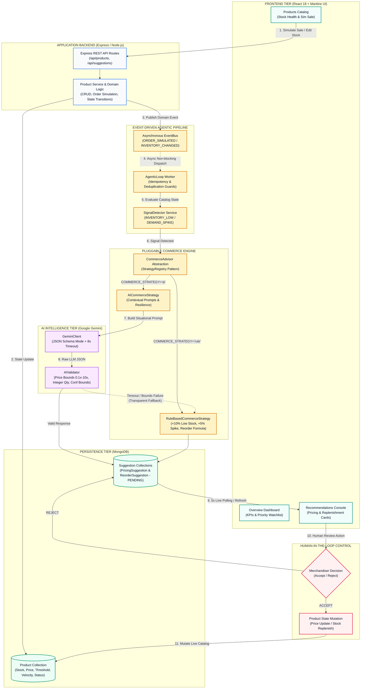
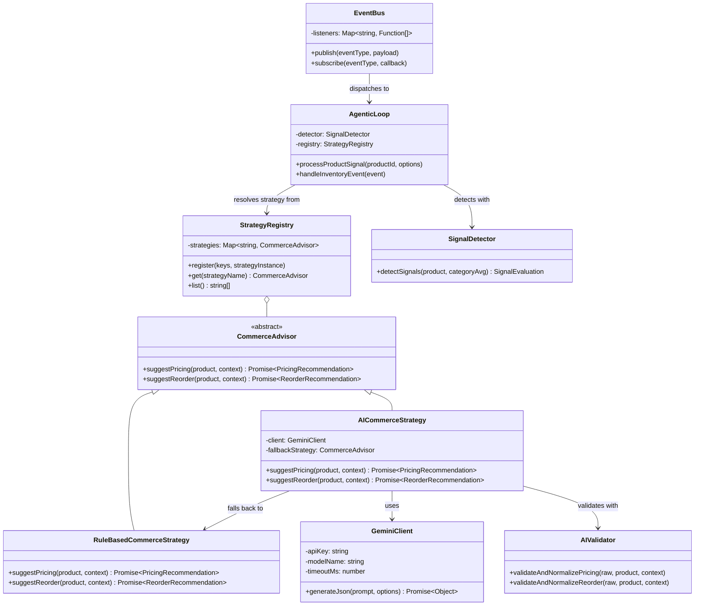
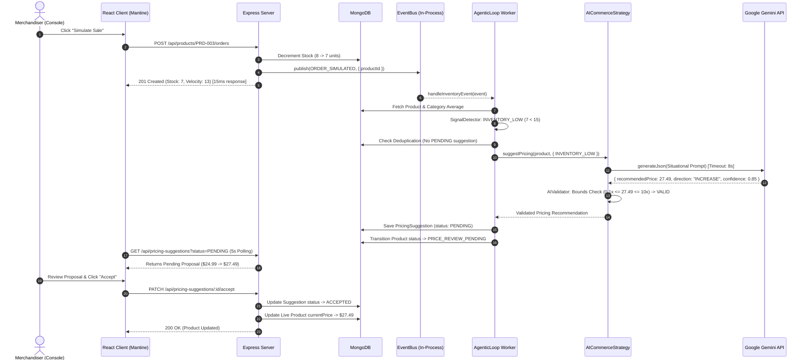

# StockPulse — System Architecture & UML Documentation

> **Complete High-Level & Detailed Architecture Reference for Technical Reviews & Presentations**

---

## 1. High-Level Flowchart Diagram

---

## 3. UML Component & Interface Architecture

---

## 4. End-to-End Execution Sequence Diagram

---

## 5. Key Architectural Pillars

| Pillar | Implementation | Technical Advantage |
|---|---|---|
| **1. Asynchronous Decoupling** | In-process `EventBus` via `setImmediate` | User-facing API mutations complete in < 15ms without blocking on LLM latency. |
| **2. Pluggable Strategy** | `CommerceAdvisor` base contract & `StrategyRegistry` | Open/Closed Principle: Add new strategies (e.g. `CompetitorAwareStrategy`) with zero changes to existing controllers. |
| **3. AI Resilience & Safety** | `AIValidator` + 8000ms timeout + `RuleBasedCommerceStrategy` fallback | Zero downtime, guaranteed valid numbers, and 100% protection against hallucinated values entering MongoDB. |
| **4. Idempotency** | Trigger-scoped deduplication in `AgenticLoop` | Prevents duplicate proposal spam during high-volume sales bursts. |
| **5. Human-in-the-Loop** | Dedicated Approval Modals & REST mutation endpoints | Full human oversight prevents unintended autonomous price swings. |
