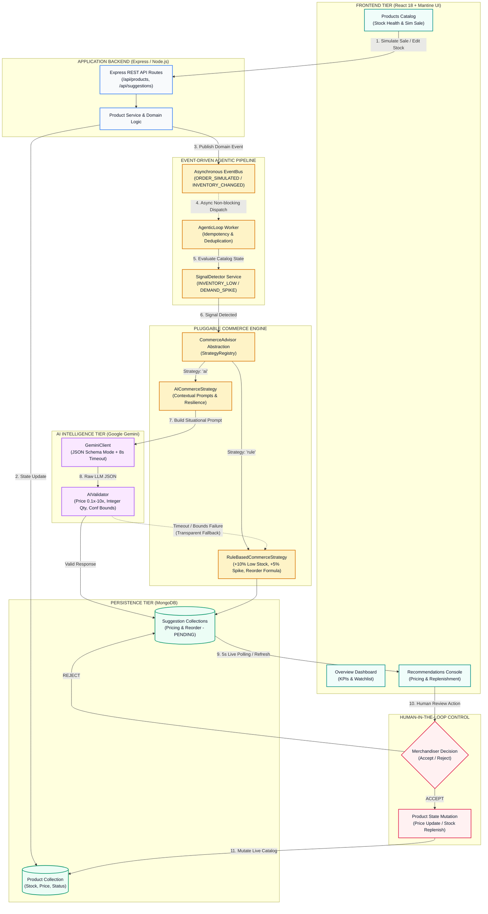

# StockPulse — AI Inventory & Dynamic Pricing Engine

> **Autonomous, Reactive Commerce Operations & Merchandising Intelligence Platform**

StockPulse is an enterprise-grade autonomous commerce operations system built on the MERN stack. It continuously monitors real-time inventory levels and sales velocity, autonomously detects supply/demand imbalances, generates AI-powered dynamic pricing proposals and inventory replenishment purchase orders, and empowers merchandising teams with a human-in-the-loop review console.

---

## Quick Start (< 5 Minutes)

### Prerequisites
- **Node.js**: v18.x or v20.x+
- **MongoDB**: Local instance running on `mongodb://127.0.0.1:27017` (or MongoDB Atlas URI)

---

### 1. Backend Setup & Clean Seed

```bash
# Navigate to backend directory
cd backend

# Install dependencies
npm install

# Copy environment template
cp .env.example .env

# Reset database & seed the 8 Addendum A products
npm run seed:clean

# Run full automated test suite (163 tests)
npm test

# Start backend server (Port 5000)
npm run dev
```

---

### 2. Frontend Setup (Merchandising Console)

In a separate terminal:

```bash
# Navigate to frontend directory
cd frontend

# Install dependencies
npm install

# Copy environment template
cp .env.example .env

# Start Vite development server
npm run dev
```

Open **`http://localhost:3000`** (or `http://localhost:3001`) in your browser.

---

## Cloud Deployment Guide

### Frontend Deployment (Vercel)
The frontend is pre-configured for Vercel deployment:
1. Connect your repository to [Vercel](https://vercel.com).
2. Set **Root Directory** to `frontend`.
3. Add Environment Variable:
   - `VITE_API_BASE_URL`: `https://your-backend-api.onrender.com` (your deployed backend URL)
4. Deploy! The frontend is accessible at `https://hackathon-blue-pi.vercel.app`.

### Backend Deployment (Render / Railway / AWS / Heroku)
1. Set **Root Directory** to `backend`.
2. Build Command: `npm install`
3. Start Command: `npm start`
4. Set Environment Variables:
   - `PORT`: `5000`
   - `MONGODB_URI`: `mongodb+srv://<user>:<password>@cluster.mongodb.net/stockpulse`
   - `COMMERCE_STRATEGY`: `rule` (or `ai`)
   - `GEMINI_API_KEY`: *(Optional)* Your Google Gemini API Key
   - `NODE_ENV`: `production`

---

## System Architecture



---

## Key Features & Technical Highlights

### 1. Autonomous Agentic Recommendation Loop
- **Event-Driven & Non-Blocking**: Customer checkout (`POST /api/products/:id/orders`) and inventory adjustments (`PATCH /api/products/:id/stock`) return immediately. Background domain events trigger the `AgenticLoop`.
- **Intelligent Signal Detection**: Evaluates catalog state against category sales velocity benchmarks.
- **Idempotency & Deduplication**: Safely prevents duplicate pending suggestions if multiple sales occur before merchandiser review.

### 2. Pluggable Multi-Strategy Commerce Engine
- **`CommerceAdvisor` Abstraction**: Common base interface enabling seamless switching via `COMMERCE_STRATEGY=rule` or `COMMERCE_STRATEGY=ai`.
- **`RuleBasedCommerceStrategy`**: Deterministic algorithms:
  - *Inventory Low*: +10% price markup to protect margin and prevent premature stockout.
  - *Demand Spike*: +5% price adjustment when product velocity exceeds 2x category average.
  - *Replenishment Target*: `(Threshold * 3) - CurrentStock` with 7-day lead time.
- **`AICommerceStrategy` (Google Gemini)**:
  - Situational prompt engineering ("Two prompts, not one" tailored for inventory deficits vs velocity surges).
  - Strict JSON schema mode.
  - Domain validation (`aiValidator.js`) enforcing price sanity bounds (0.1x to 10x), integer quantities, and confidence metrics (0.0 to 1.0).
  - **Transparent Fallback**: Automatically degrades to rule strategy on timeouts (8000ms), API quota exhaustion, or parsing failures.

### 3. Human-in-the-Loop Merchandising Console
- **Production Light Theme**: Clean SaaS design with high-contrast typography (`#0f172a`), subtle borders (`#e2e8f0`), and soft shadows.
- **Overview Hub**: Operational KPI metrics, active attention alerts, and priority inventory watchlist.
- **Products Catalog**: Real-time inventory health progress bars, instant 1-click customer order simulation, and stock editor modal.
- **Recommendations Console**: Dual-tab review for Dynamic Pricing and Inventory Replenishment with 6-part hierarchy and approval confirmation modals.

---

## REST API Reference

### Health & Monitoring
| Method | Endpoint | Description |
|---|---|---|
| `GET` | `/api/health` | Backend status, service name, and timestamp |

### Products Catalog
| Method | Endpoint | Description |
|---|---|---|
| `GET` | `/api/products` | Query catalog with `category`, `status`, `page`, and `limit` filters |
| `GET` | `/api/products/:id` | Retrieve single product by MongoDB ID or SKU |
| `POST` | `/api/products` | Create new product SKU |
| `PUT` | `/api/products/:id` | Full update of product details |
| `PATCH` | `/api/products/:id/stock` | Directly update stock level & trigger agentic loop |
| `POST` | `/api/products/:id/orders` | Simulate customer purchase order & trigger agentic loop |

### Recommendations & Human Review
| Method | Endpoint | Description |
|---|---|---|
| `GET` | `/api/pricing-suggestions` | List dynamic pricing suggestions (filter by `status`, `triggerReason`) |
| `PATCH` | `/api/pricing-suggestions/:id/accept` | Human approval: updates live product price to recommended price |
| `PATCH` | `/api/pricing-suggestions/:id/reject` | Human rejection: dismisses pricing suggestion |
| `GET` | `/api/reorder-suggestions` | List replenishment suggestions (filter by `status`, `triggerReason`) |
| `PATCH` | `/api/reorder-suggestions/:id/accept` | Human approval: simulates PO delivery & replenishes stock level |
| `PATCH` | `/api/reorder-suggestions/:id/reject` | Human rejection: dismisses replenishment suggestion |

---

## Environment Variables

### Backend (`backend/.env`)
```ini
PORT=5000
MONGODB_URI=mongodb://127.0.0.1:27017/stockpulse
COMMERCE_STRATEGY=rule    # Options: 'rule' | 'ai'
GEMINI_API_KEY=your_gemini_api_key_here
GEMINI_MODEL=gemini-1.5-flash
GEMINI_TIMEOUT_MS=8000
NODE_ENV=development
```

### Frontend (`frontend/.env`)
```ini
# Local development
VITE_API_BASE_URL=http://localhost:5000

# Production deployment
# VITE_API_BASE_URL=https://your-backend-api.onrender.com
```

---

## Automated Testing Suite

The project features a **100% passing automated test suite** with **163 unit and integration tests**:

```bash
cd backend
npm test
```

| Suite | Tests | Covered Scope |
|---|:---:|---|
| **Domain Models** (`testModels.js`) | **21** | Schemas, unique indexes, enum validation, price sanity bounds |
| **Product REST APIs** (`testApi.js`) | **36** | CRUD endpoints, category filters, pagination, order simulations, 409 conflict checks |
| **Commerce Engine** (`testCommerceEngine.js`) | **37** | StrategyRegistry, RuleBasedStrategy (+10% low stock, +5% demand spike), Reorder formula |
| **AI Advisor** (`testAiAdvisor.js`) | **33** | Gemini prompt builder, AIValidator sanity bounds, timeout protection, fallback resilience |
| **Agentic Loop** (`testAgenticLoop.js`) | **36** | SignalDetector, EventBus, auto-triggers, deduplication, human accept/reject workflows |
| **Total** | **163** | **163 Passed / 0 Failed (100% Pass Rate)** |

---

## Architecture Decision Records (ADRs)

Documented in detail in [`ADR.md`](file:///c:/Users/zycus/Desktop/Greenal%20Tambe/ADR.md):

- **ADR-1: Dual Identity Strategy (`_id` and `productId` / `sku`)** — Backward compatibility across MongoDB ObjectIds and human-readable SKU strings.
- **ADR-2: Event-Driven Agentic Recommendation Loop** — Decoupling recommendation generation from user request threads via asynchronous domain events.
- **ADR-3: Pluggable Commerce Engine (`StrategyRegistry`)** — Open/Closed Principle enabling seamless switching between Rule-Based, AI-Powered, and future strategies.
- **ADR-4: LLM Failure Handling & Resilience** — Timeout guards, structured schema validation, and automatic rule fallback on LLM exceptions.
- **ADR-5: Suggestion Idempotency & Deduplication** — Prevention of duplicate pending proposals for the same product and trigger condition.
- **ADR-6: Human-in-the-Loop Review Architecture** — Explicit human approval required before mutating live catalog prices or triggering purchase orders.

---

## Seed Data Catalog (Addendum A)

| ID | SKU | Name | Category | Base Price | Stock | Threshold | Velocity | Initial Status |
|---|---|---|---|---|---|---|---|---|
| `PRD-001` | `SKU-ELEC-001` | Wireless Earbuds Pro | `ELECTRONICS` | $79.99 | 45 | 20 | 3 | `ACTIVE` |
| `PRD-002` | `SKU-ELEC-002` | USB-C Hub 7-Port | `ELECTRONICS` | $34.99 | 120 | 30 | 1 | `ACTIVE` |
| `PRD-003` | `SKU-APP-001` | Organic Cotton T-Shirt | `APPAREL` | $24.99 | 8 | 15 | 12 | `PRICE_REVIEW_PENDING` |
| `PRD-004` | `SKU-APP-002` | Running Shorts — Navy | `APPAREL` | $39.99 | 55 | 20 | 2 | `ACTIVE` |
| `PRD-005` | `SKU-HOME-001` | Ceramic Pour-Over Set | `HOME` | $49.99 | 22 | 10 | 4 | `ACTIVE` |
| `PRD-006` | `SKU-HOME-002` | LED Desk Lamp — Dimmable | `HOME` | $59.99 | 0 | 15 | 0 | `OUT_OF_STOCK` |
| `PRD-007` | `SKU-ELEC-003` | Portable Charger 20K | `ELECTRONICS` | $44.99 | 18 | 25 | 8 | `ACTIVE` |
| `PRD-008` | `SKU-APP-003` | Hoodie — Heather Grey | `APPAREL` | $54.99 | 11 | 12 | 15 | `ACTIVE` |

---

## License & Acknowledgments
Built for the **StockPulse Agentic Commerce Hackathon**.
Licensed under the ISC License.
